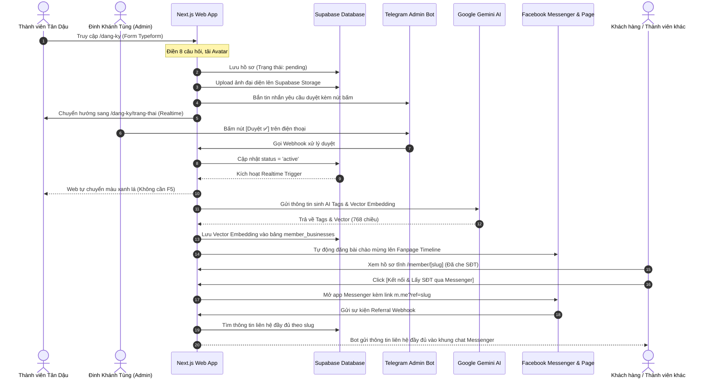

# 🐓 KIM KÊ CONNECT (AI NETWORK) - TÀI LIỆU DỰ ÁN TOÀN DIỆN

**Kim Kê Connect** là mạng lưới tri thức và kết nối giao thương thông minh (AI Business Network) được xây dựng từ đầu dành riêng cho cộng đồng Tân Dậu 1981. Hệ thống kết hợp sức mạnh của **Next.js (App Router)**, **Supabase (pgvector)**, **Google Gemini API** và các kênh chatbot phổ biến (**Telegram & Facebook Messenger**) nhằm tối ưu hóa chi phí vận hành ở mức **0 VNĐ (Free Tier)**.

---

## 🗺️ 1. Sơ đồ Kiến trúc & Luồng vận hành (UX Flow)

Dưới đây là sơ đồ chi tiết cách thức dữ liệu di chuyển từ lúc đăng ký đến lúc kết nối trên Messenger:



---

## 💎 2. Các Khía cạnh Kỹ thuật chính (Core Features)

### 2.1. Giao diện Web (Tối ưu Mobile First & Trải nghiệm Wow)
*   **Landing Page phễu marketing (`src/app/page.tsx`)**: Tập trung thuyết phục chuyển đổi bằng hình ảnh 3D thương hiệu gà vàng AI, các số liệu thống kê trực quan, các lý do gắn kết cộng đồng Tân Dậu và bảng FAQ giải đáp thắc mắc. Không public danh bạ để bảo mật thông tin nội bộ.
*   **Form Đăng ký phong cách Typeform (`src/app/dang-ky/page.tsx`)**:
    *   Mỗi màn hình hiển thị đúng 1 câu hỏi lớn, chữ to, trực quan, giảm cảm giác ngợp khi phải điền nhiều thông tin.
    *   Hỗ trợ phím tắt **Enter** để chuyển tiếp tự động sang câu tiếp theo.
    *   Có thanh tiến trình (Progress Bar) phần trăm hoàn thành mượt mà.
    *   Hỗ trợ xem trước ảnh (Preview) ngay khi tải file lên.
*   **Trang trạng thái Realtime (`src/app/dang-ky/trang-thai/page.tsx`)**: Lắng nghe thay đổi của database thông qua kênh **Supabase Realtime**. Khi Admin duyệt trên Telegram, trang web của người dùng sẽ tự động chuyển màu xanh lá và mở các nút hành động mà không cần tải lại trang.
*   **Trang Hồ sơ SEO cá nhân (`src/app/member/[slug]/page.tsx`)**: 
    *   Tự động sinh metadata động và cấu hình Schema JSON-LD giúp Google dễ dàng lập chỉ mục (index), tăng lượng khách hàng tự nhiên tìm đến dịch vụ của thành viên.
    *   **Bảo mật 2 lớp**: Số điện thoại bị che dạng `0912.***.***`. Khách muốn lấy SĐT và liên kết Zalo/Facebook bắt buộc phải click nút kết nối dẫn sang Messenger Bot.

### 2.2. Chatbot Messenger & Cơ chế AI Search
*   **AI Semantic Search**: Người dùng chat ngôn ngữ tự nhiên trên Messenger để tìm dịch vụ (ví dụ: *"Tìm người làm cơ điện ở Hà Nội"*). Hệ thống gọi API Gemini tạo vector embedding từ câu hỏi, sau đó truy vấn pgvector để tìm ra những thành viên phù hợp nhất dựa trên khoảng cách Cosine.
*   **Search Cache**: Tạo bảng `search_cache` lưu trữ các câu hỏi cũ và vector tương ứng. Khi gặp lại câu hỏi tương đương, hệ thống lấy ngay vector từ cache mà không cần gọi API Gemini $\rightarrow$ **Tiết kiệm 90% chi phí và tăng tốc độ phản hồi dưới 1 giây**.
*   **Trợ lý ảo đàm thoại**: Sử dụng model **Gemini 1.5 Flash** để viết câu trả lời thân mật, xưng hô "Kim Kê Connect" - "đồng đội", tự động ẩn 3 số cuối điện thoại của các thành viên chưa xác minh (Verified) để bảo vệ quyền lợi.
*   **Cơ chế Mute Bot (Phân biệt Chat thường và Chatbot)**: 
    *   Khi khách hàng nhắn tin yêu cầu gặp Admin (ví dụ: *gặp admin, hỗ trợ trực tiếp, nói chuyện với người thật...*).
    *   Hệ thống tự động tắt (Mute) tính năng tự động trả lời của Bot đối với khách hàng đó trong **24 giờ** và ghi nhận vào bảng `messenger_mute_sessions`.
    *   Hệ thống bắn ngay một cảnh báo đẩy về Telegram của Admin: *"Admin ơi, có khách cần chat tay!"* để Admin vào Page Inbox nhắn tin thủ công mà không bị Bot nhảy vào tranh nói.

### 2.3. Telegram Admin Bot (Quản trị bỏ túi)
*   **Duyệt hồ sơ nhanh**: Gửi tin nhắn chứa đầy đủ thông tin kèm 2 nút bấm `[Duyệt ✅]` và `[Từ chối ❌]`. Admin bấm duyệt ngay trên điện thoại khi đi cafe hoặc đi làm.
*   **Các lệnh điều khiển nhanh qua chat**:
    *   `/giahan <sdt> <so_ngay>`: Xác minh thành viên (Verified) và gia hạn thời gian hiển thị.
    *   `/suspend <sdt>`: Tạm khóa tài khoản thành viên, ẩn thông tin khỏi bot và web.
    *   `/delete <sdt>`: Xóa vĩnh viễn tài khoản thành viên khỏi database.
    *   `/help` hoặc `/start`: Hiển thị hướng dẫn.

---

## 🗄️ 3. Cơ sở dữ liệu (Supabase Schema)

Dữ liệu được phân tách làm 3 bảng chuyên biệt để tối ưu hóa hiệu năng truy vấn, lưu trữ vector và mở rộng lâu dài:

### 3.1. Bảng `member_profiles` (Thông tin cá nhân & liên hệ)
```sql
CREATE TABLE member_profiles (
    id UUID PRIMARY KEY DEFAULT gen_random_uuid(),
    fullname VARCHAR(255) NOT NULL,
    slug VARCHAR(255) UNIQUE NOT NULL,             -- Dùng cho Clean URL SEO
    phone VARCHAR(20) NOT NULL UNIQUE,
    email VARCHAR(255),
    province VARCHAR(100) NOT NULL,
    district VARCHAR(100),
    facebook_link TEXT,
    zalo_link TEXT,
    website TEXT,
    avatar_url TEXT,                               -- Đường dẫn ảnh lưu trên Storage
    status VARCHAR(20) DEFAULT 'pending',          -- pending (chờ duyệt), active (hoạt động), suspended (tạm khóa)
    is_verified BOOLEAN DEFAULT FALSE,             -- Trạng thái xác minh (Verified)
    expired_at TIMESTAMP WITH TIME ZONE,           -- Hạn hiển thị Verified
    reputation_score INT DEFAULT 50,               -- Điểm uy tín thành viên
    supported_count INT DEFAULT 0,                 -- Số lần hỗ trợ đồng đội
    referred_count INT DEFAULT 0,                  -- Số người giới thiệu tham gia
    created_at TIMESTAMP WITH TIME ZONE DEFAULT NOW()
);
```

### 3.2. Bảng `member_businesses` (Thông tin chuyên môn & Vector AI)
```sql
CREATE TABLE member_businesses (
    id UUID PRIMARY KEY REFERENCES member_profiles(id) ON DELETE CASCADE,
    primary_job VARCHAR(255) NOT NULL,             -- Nghề chính
    secondary_jobs TEXT[],                         -- Nghề phụ (Dạng mảng)
    skills TEXT[],                                 -- Kỹ năng
    services TEXT[],                               -- Dịch vụ
    products TEXT[],                               -- Sản phẩm
    bio TEXT,                                      -- Giới thiệu ngắn
    ai_tags TEXT[],                                -- Thẻ AI tự động sinh
    profile_document TEXT,                         -- Văn bản tổng hợp để tạo vector
    profile_embedding vector(768),                 -- Vector 768 chiều từ Gemini text-embedding-004
    portfolio_images TEXT[]                        -- Ảnh sản phẩm (Verified mới hiện)
);
```

### 3.3. Bảng `member_connections` (Nhu cầu AI Matching)
```sql
CREATE TABLE member_connections (
    id UUID PRIMARY KEY DEFAULT gen_random_uuid(),
    member_id UUID REFERENCES member_profiles(id) ON DELETE CASCADE,
    needs TEXT,                                    -- Nhu cầu tìm kiếm
    cooperation_opportunities TEXT,                -- Cơ hội hợp tác
    updated_at TIMESTAMP WITH TIME ZONE DEFAULT NOW()
);
```

---

## 🚀 4. Hướng dẫn Triển khai chi tiết (Step-by-Step Deploy)

### Bước 1: Khởi tạo Database trên Supabase
1.  Đăng ký tài khoản miễn phí tại [Supabase](https://supabase.com). Tạo một Project mới.
2.  Mở mục **SQL Editor** ở thanh menu trái $\rightarrow$ chọn **New Query**.
3.  Copy toàn bộ nội dung file [database/setup.sql](file:///d:/Dev/Projects/Web_App/danhbatandau/database/setup.sql) paste vào bảng biên dịch.
4.  Bấn **Run** để khởi tạo cấu trúc bảng, các trigger và hàm tìm kiếm vector.

### Bước 2: Tạo Storage Bucket cho Ảnh đại diện
1.  Trên giao diện quản lý Supabase, truy cập vào menu **Storage**.
2.  Bấm **New Bucket**, nhập tên bucket chính xác là `avatars`.
3.  Bật tùy chọn **Public** (Để mọi người có thể xem ảnh đại diện công khai).

### Bước 3: Lấy Google Gemini API Key
1.  Truy cập [Google AI Studio](https://aistudio.google.com/).
2.  Đăng nhập bằng tài khoản Gmail và bấm nút **Get API Key** để tạo một API key miễn phí.

### Bước 4: Thiết lập Bot Telegram Admin
1.  Mở ứng dụng Telegram, chat với bot [@BotFather](https://t.me/botfather) gõ lệnh `/newbot` để tạo bot và lấy `HTTP API Token`.
2.  Tìm Chat ID tài khoản cá nhân của bạn bằng cách chat với bot [@userinfobot](https://t.me/userinfobot).
3.  Cấu hình webhook để Telegram đẩy tin nhắn về web của bạn bằng cách truy cập link sau trên trình duyệt (thay thế token và domain vercel của bạn):
    `https://api.telegram.org/bot<YOUR_TELEGRAM_BOT_TOKEN>/setWebhook?url=https://<YOUR_VERCEL_DOMAIN>/api/telegram-webhook`

### Bước 5: Thiết lập Fanpage và Chatbot Facebook Messenger
1.  Truy cập [Facebook Developers](https://developers.facebook.com/). Tạo một ứng dụng Facebook mới, chọn loại sản phẩm **Messenger**.
2.  Liên kết ứng dụng với Fanpage của bạn, bấm tạo **Page Access Token** (mã truy cập trang) và lưu lại.
3.  Cấu hình Webhook của Facebook trỏ về đường dẫn: `https://<YOUR_VERCEL_DOMAIN>/api/webhook`. Nhập mã token xác minh (Verify Token) bất kỳ do bạn tự định nghĩa.

### Bước 6: Cấu hình biến môi trường và Deploy lên Vercel
1.  Copy nội dung file `.env.local.example` thành file `.env.local` ở máy local của bạn và điền đầy đủ các mã token đã lấy.
2.  Đưa mã nguồn lên GitHub của bạn.
3.  Truy cập [Vercel](https://vercel.com) liên kết với tài khoản GitHub và Deploy project Next.js này lên.
4.  Trong phần cài đặt dự án (Project Settings) trên Vercel, mở mục **Environment Variables** và điền đầy đủ các biến môi trường sau:
    *   `NEXT_PUBLIC_SUPABASE_URL`: Đường dẫn API của Supabase.
    *   `NEXT_PUBLIC_SUPABASE_ANON_KEY`: Mã Anon key của Supabase.
    *   `SUPABASE_SERVICE_ROLE_KEY`: Mã đặc quyền Admin của Supabase (Bắt buộc để lưu file lên Storage).
    *   `GEMINI_API_KEY`: API key của Google Gemini.
    *   `TELEGRAM_BOT_TOKEN`: Token của Telegram Bot quản trị.
    *   `TELEGRAM_ADMIN_CHAT_ID`: Chat ID của Admin Đinh Khánh Tùng.
    *   `FACEBOOK_PAGE_ACCESS_TOKEN`: Token truy cập trang Facebook.
    *   `FACEBOOK_VERIFY_TOKEN`: Token xác minh webhook Facebook (Tự đặt).
    *   `NEXT_PUBLIC_APP_URL`: Domain Vercel chính thức của bạn (Ví dụ: `https://kimke-connect.vercel.app`).
